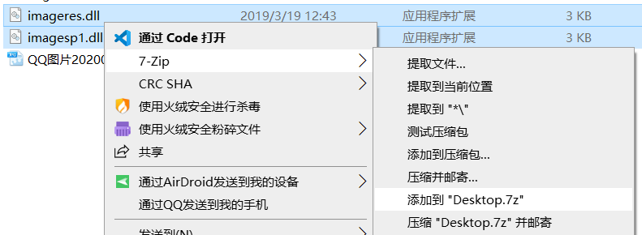
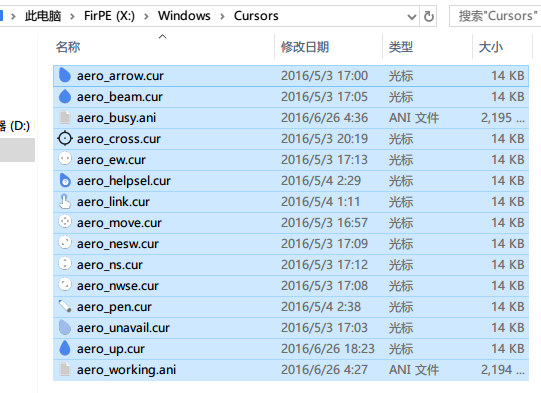
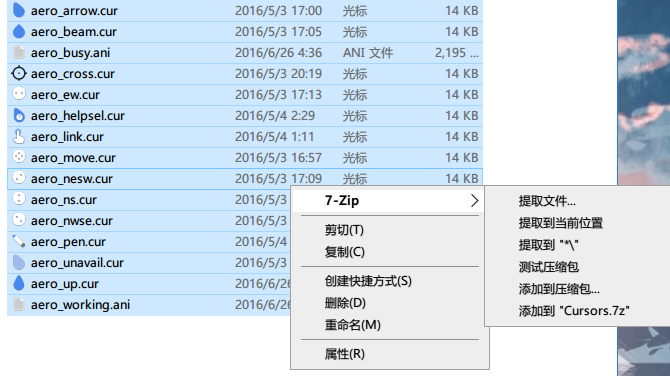
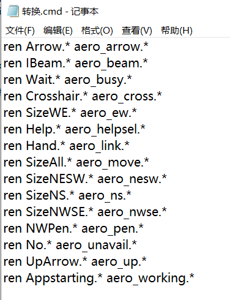
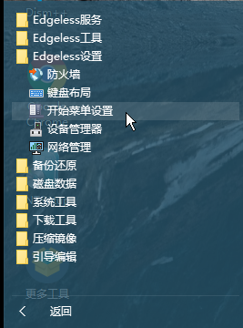
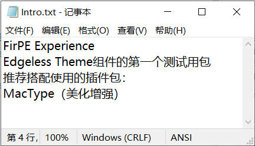

:::warning 您可以不经过Edgeless团队的同意自由更改发布插件作品，但是请不要忘记您的道德操守。

我们不希望看到有违反Edgeless三无精神（无劫持、无广告、无收费）或是违反中华人民共和国相关法律条款的作品出现，也不会承认此类作品与我们有任何关系。

继续开发视为您已经同意此条款
:::

> 如果您希望能上架您的主题包/资源包，请[加入内测交流QQ群](https://www.edgeless.top/jump/qqg.html)进行提交

## 获取Edgeless合作伙伴的资源
Edgeless团队已与[致美化](https://zhutix.com)达成版权授权合作，开发主题资源包时可以使用致美化平台**没有独家标识**的资源
查看本章节的子章节 [如何使用主题抓取套件](如何使用致美化的素材.md) 获取致美化的素材适配教程


## 使用下载站已有的资源包搭配生成主题包
我们允许主题包作者将下载站现存的资源包混合进主题包中搭配生成主题包，但是需要在主题包的`Intro.txt`或者`Intro.wcs`中申明引用的资源包的完整名称，例如 “系统图标资源包引用自`我的系统图标包_1.0.0.0_卡诺`” 


## 介绍、瞎扯与Q&A

**Edgeless主题包（Edgeless Theme Pack）是由Edgeless提出的一种全新的主题包规范，旨在从界面美化方面突破传统套壳PE的瓶颈，搭配Edgeless插件包实现真正意义上的PE全面自定义**


有一说一，当初制定插件包规范的时候野心太大了，希望插件包能统揽全局，包括目前主题包所能做到的全部寄希望于插件包。但是这一想法对于开发者来说还是有一些不切实际，就像要求所有开发者都使用汇编语言写程序而不提供高级语言一样，开发难度太大。而且由于各开发者的实现方法不统一，管理起来也比较混乱。因此Edgeless正在尝试将插件包的功能逐步细化，主题包就是我们迈出的第一步，开发者只需要专注于内容上的差异，而不需要关注其底层的实现，开发过程自然也就会容易很多，也会不断涌现更多的优质资源
>
> 
> 此次推出主题包规范，Edgeless的精力主要花费在制定规范和实现方案上。相比较于插件包简单粗暴、自由开放的画风，主题包的规范需要更加全面的考虑，兼顾统一性和拓展能力。因此如果您有好的意见或建议请联系我们，我们会考虑对其进行改进

>Q：主题包与资源包是什么关系？
A：主题包内包含资源包（比如LoadScreen资源包、鼠标样式资源包等等），为了方便某些不适合做成主题包的资源单独发布而赋予了“资源包”这一称呼

>Q：发布完主题包需要将其中用到的资源包单独再发布吗？
A：不需要，我们为主题包准备了“混搭”功能，方便用户单独应用主题包中的某个资源包

## 主题包能力范围

**可以直接实现干预**
* 启动界面
 （Edgeless LoadScreen™）
* 壁纸
* 桌面快捷方式图标
* 系统图标
* 开始菜单样式
* 鼠标指针

**无法直接实现干预**
* 由开发者推荐搭配使用插件包（包含在Intro文件内供用户选择，以实现更全面的主题体验）
* 提供用户手动选择的设置选项（需由开发者编写Intro.wcs实现）


## 主题包文件（.eth）释义
主题包本质是一个后缀名为.eth的7z压缩文件，其中包含如下组成部件（均为可选添加）
### SystemIconPack.ess
 系统图标资源包，本质为7z压缩包，包含imageres.dll imagesp1.dll两个文件
### IconPack.eis
图标资源包，主要用于修改桌面快捷方式图标，同时还可以修改一些Edgeless自带的图标。其中的内容将被覆盖释放到X:\Users\Icon文件夹（Edgeless Ico类型图标统一存放文件夹）
### MouseStyle.ems
鼠标样式资源包，本质为7z压缩包，包含aero_开头的鼠标指针样式文件
### LoadScreen.els
 本质为7z压缩包，包含Edgeless LoadScreen™（启动界面）所使用的图片，最多3张（文件名为loadx.jpg，x取值范围为0-2）
### StartIsBackConfig.esc
开始菜单样式配置文件，本质为wcs脚本文件，包含StartIsBack的注册表配置信息,并且允许控制系统和应用是否使用浅色主题。

**严禁使用此文件进行除修改StartIsBack相关注册表和修改系统/应用是否使用浅色主题以外的操作**

### WallPaper.jpg
壁纸图片

### Intro.txt/Intro.wcs
主题简介/控制面板

Intro.txt的内容将在用户双击打开主题包时弹出的Edgeless主题包管理器中直接显示，Intro.wcs脚本在用户双击打开主题包时运行（与Edgeless主题包管理器同时弹出）

Intro.txt主要用于简单介绍此主题包，而Intro.wcs则实现了一个控制面板的功能，可以推荐搭配使用的插件包或供用户进行一些自定义操作

这两个文件可以同时存在，但是不建议缺少Intro.txt；此外，这两个文件均需要使用GB2312（ANSI）编码，否则会导致Edgeless主题包管理器显示乱码


> **注意：脚本内不得包含未经用户点击确认直接执行的任何操作和任何的恶意操作，否则此主题包将不得上架Edgeless官方认证的下载站（Edgeless团队保留对此处申明的“未经用户点击确认直接执行的任何操作”和“恶意操作”的解释权，其中“恶意操作”一定包括违反Edgeless提出的“三无原则）**


### Intro（文件夹）

由于Edgeless只会有针对性地处理主题包内符合规范的文件，如果你编写了Intro.wcs脚本并且需要一些依赖组件，你必须将所有用到的依赖组件放置在此文件夹内，并在脚本中使用`%CurDir%\Intro\`调用相关文件


## 典型开发步骤
:::warning 注意
由于资源包安装程序的命名校验代码存在缺陷，如果需要单独制作资源包，则其文件名中不可出现英文括号()
:::
### 系统图标资源包（[主题包抓取套件](如何使用致美化的素材.md)可用）

导出Edgeless中的X:\\Windows\\System32\\imageres.dll和X:\\Windows\\System32\\imagesp1.dll两个文件，使用Resource Hacker对其进行编辑。具体可以参考[此处](https://wenku.baidu.com/view/38c29723bcd126fff7050b4b.html)
编辑完成后将imageres.dll和imagesp1.dll压缩为7z压缩包，重命名为SystemIconPack.ess

>注：如果仅修改了imageres.dll而没有修改imagesp1.dll，请使用Edgeless自带的imagesp1.dll，应用缺失imagesp1.dll的系统图标资源包可能导致某些图标显示出错

### 图标资源包
参考X:\Users\Icon文件夹内的排布情况。比如只需要对桌面快捷方式图标进行修改，那么创建一个“shortcut”文件夹，保持文件夹内的.ico文件与希望替换的桌面快捷方式文件名一致（后缀名除外）。例如，希望使用x.ico作为Edgeless桌面上NTSetup.lnk的图标，则将x.ico重命名为NTSetup.ico即可
完成后将shortcut文件夹（如果涉及到了type等文件夹的修改，请将其一并压缩）压缩为7z压缩包，重命名为IconPack.eis

### 鼠标样式资源包（[主题包抓取套件](如何使用致美化的素材.md)可用）
将鼠标样式文件（.cur或.ani）按照areo_前缀的类型规范命名
完成后将所有样式文件压缩为7z压缩包，重命名为MouseStyle.ems

**附：文件名规范对照表**

规范一
| 标准文件名 | 释义 | 旧标文件名 |
| --- | --- | --- |
aero_arrow.cur|正常选择|Arrow
aero_beam.cur|选定文本|IBeam
aero_busy.ani|忙|Wait
aero_cross.cur|精确选择|Crosshair\Cross
aero_ew.cur|水平调整大小|SizeWE
aero_helpsel.cur|帮助选择|Help
aero_link.cur|链接选择|Hand
aero_move.cur|移动|SizeAll
aero_nesw.cur|沿对角线调整大小2（右上左下）|SizeNESW
aero_ns.cur|垂直调整大小|SizeNS
aero_nwse.cur|沿对角线调整大小1（左上右下）|SizeNWSE
aero_pen.cur|手写|NWPen
aero_unavail.cur|不可用|No
aero_up.cur|候选|UpArrow
aero_working.ani|后台运行|Appstarting


规范二
|标准文件名|释义|旧标文件名|
| --- | --- | --- |
aero_arrow.cur|正常选择|Normal Select
aero_beam.cur|选定文本|Text Select
aero_busy.ani|忙|Busy
aero_cross.cur|精确选择|Precision Select
aero_ew.cur|水平调整大小|Horizontal Resize
aero_helpsel.cur|帮助选择|Help Select
aero_link.cur|链接选择|Link Select
aero_move.cur|移动|Move
aero_nesw.cur|沿对角线调整大小2（右上左下）|Diagonal Resize 2
aero_ns.cur|垂直调整大小|Vertical Resize
aero_nwse.cur|沿对角线调整大小1（左上右下）|Diagonal Resize 1
aero_pen.cur|手写|Handwriting
aero_unavail.cur|不可用|Unavailable
aero_up.cur|候选|Alternate Select
aero_working.ani|后台运行|Working In Background

**附：旧版规范快速转换批处理**
```
::处理规范一
ren Arrow.* aero_arrow.*
ren IBeam.* aero_beam.*
ren Wait.* aero_busy.*
ren Crosshair.* aero_cross.*
ren Cross.* aero_cross.*
ren SizeWE.* aero_ew.*
ren Help.* aero_helpsel.*
ren Hand.* aero_link.*
ren SizeAll.* aero_move.*
ren SizeNESW.* aero_nesw.*
ren SizeNS.* aero_ns.*
ren SizeNWSE.* aero_nwse.*
ren NWPen.* aero_pen.*
ren No.* aero_unavail.*
ren UpArrow.* aero_up.*
ren Appstarting.* aero_working.*
::处理规范二
ren "Normal Select.*" "aero_arrow.*"
ren "Text Select.*" "aero_beam.*"
ren "Busy.*" "aero_busy.*"
ren "Precision Select.*" "aero_cross.*"
ren "Horizontal Resize.*" "aero_ew.*"
ren "Help Select.*" "aero_helpsel.*"
ren "Link Select.*" "aero_link.*"
ren "Move.*" "aero_move.*"
ren "Diagonal Resize 2.*" "aero_nesw.*"
ren "Vertical Resize.*" "aero_ns.*"
ren "Diagonal Resize 1.*" "aero_nwse.*"
ren "Handwriting.*" "aero_pen.*"
ren "Unavailable.*" "aero_unavail.*"
ren "Alternate Select.*" "aero_up.*"
ren "Working In Background.*" "aero_working.*"
```
### 开始菜单样式配置文件
1. 运行开始菜单内的`Edgeless设置-开始菜单设置`（或在开始菜单面板空处右键-属性），对StartIsBack进行样式修改
2. 使用CMD命令
`REG EXPORT HKEY_CURRENT_USER\Software\StartIsBack X:\Users\Default\Desktop\StartIsBackConfig.reg`
导出StartIsBack的注册表信息到桌面
3. 使用[五大提供的转换工具](http://blog.sina.com.cn/s/blog_6fd804fe0102wq8v.html)将此reg文件转换为wcs脚本，并整理脚本中的语句（**执行前取消所有复选框，执行后删除开头处多余的非REGI开头的语句**）


4. 确定好主题的基本基调（浅色/深色），并在转换得到的`StartIsBackConfig.reg.wcs`中添加以下语句


**如果不添加可能导致用户在多次应用主题包或开始菜单样式配置文件后开始菜单和/或资源管理器主题显示失常**

**浅色：**
```
//修改系统主题为浅色（可以让StartIsBack使用黑色Win徽标和开始菜单文字）：
REGI #HKCU\Software\Microsoft\Windows\CurrentVersion\Themes\Personalize\\SystemUsesLightTheme=1
//修改应用主题为浅色：
REGI #HKCU\Software\Microsoft\Windows\CurrentVersion\Themes\Personalize\\AppsUseLightTheme=1
```
**深色：**
```
//修改系统主题为深色：
REGI #HKCU\Software\Microsoft\Windows\CurrentVersion\Themes\Personalize\\SystemUsesLightTheme=0
//修改应用主题为深色（可以让资源管理器进入深色主题）：
REGI #HKCU\Software\Microsoft\Windows\CurrentVersion\Themes\Personalize\\AppsUseLightTheme=0
```
5、将脚本重命名为StartIsBackConfig.esc
### LoadScreen资源
选择三张壁纸级别的图片转换为jpg格式，分别重命名为load0.jpg、load1.jpg、load2.jpg
>1. load0.jpg将在Win10徽标过后第一个显示，对应桌面环境载入和必要驱动安装；load1.jpg对应插件包载入和用户个性化设置；load2.jpg在进入桌面前一秒显示并淡出，标志着初始化完成
>2. load0不可缺失，load1和load2可以缺失

将所有用到的图片压缩为7z压缩包，重命名为LoadScreen.els
### 壁纸图片
将适合作为壁纸的图片转换为jpg格式，重命名为WallPaper.jpg
### 主题简介/控制面板
Intro.txt主要以文本形式简单介绍主题包，注意使用GB2312（ANSI）编码
Intro.wcs允许创建窗口界面进行一些自定义设置，其需要用到的依赖文件必须全部放置在“Intro”文件夹内，注意使用GB2312（ANSI）编码


# 开发案例
这里以开发FirPE Experience为例介绍如何开发一个主题包。
> 此主题包的开发和教程的发布得到了FirPE开发者 杉 的同意，各位在进行开发前一定要获取作者授权！

## 系统图标资源包
>此资源包的开发可以使用[主题包抓取套件](如何使用致美化的素材.md)

1. 提取出System32目录下的imageres.dll和imagesp1.dll。但是由于此处没有提供imagesp1.dll，因此我们使用Edgeless内提取的imagesp1.dll代替

2. 将imageres.dll和imagesp1.dll压缩为7z压缩包

3. 将文件重命名为SystemIconPack.ess，保存备用


## 图标资源包
1. 找到桌面快捷方式图标文件（.ico）的存放位置，将其收集
2. 参考Edgeless桌面的快捷方式名称将其依次重命名。

**所有的图标包必须包含这六个快捷方式的图标！**


3. 如果需要为插件包快捷方式适配图标，**参考相应插件包创建的快捷方式名称为其适配图标即可**。如果不方便载入插件查看，可以通过插件包的外置批处理为其适配图标。
>此处讲解如何在不方便加载插件包的情况下查看插件创建的快捷方式名称，以Copur开发的Chrome插件包为例
>1. 下载Google 80.0.3976.0718417_Copur.7z并打开

>2. 查看外置批处理（.cmd或.wcs，此处为chrome.wcs）中创建桌面快捷方式的命令，获得对桌面创建的快捷方式名称

4. 将所有应用于快捷方式的图标放置在`shortcut`文件夹内，将`shortcut`文件夹压缩为7z压缩包

5. 将文件重命名为IconPack.eis，保存备用


## 鼠标样式资源包
>此资源包的开发可以使用[主题包抓取套件](如何使用致美化的素材.md)

1. 找到光标样式文件的存放位置，提取所有光标样式文件

2. 如果光标样式文件命名不符合规则，请使用上方的`旧版规范快速转换批处理`进行转换。此处提取的文件符合命名规范，直接压缩为7z压缩包即可

>`旧版规范快速转换批处理`使用方法
>1. 新建一个文本文件，将上方的`旧版规范快速转换批处理`内容复制进去，重命名为`转换.cmd`

>2. 将`转换.cmd`移动到光标样式文件的存放位置并运行即可完成转换

3. 将文件重命名为MouseStyle.ems，保存备用


## LoadScreen资源包
1. 找到启动界面图片的存放位置（具体位置请查看pecmd.ini的logo命令，此处启动界面与默认壁纸位置相同），提取并转换为jpg格式（此处已经是jpg格式）

2. 将图片命名为load0.jpg并压缩
>注意：此处制作的LoadScreen资源包为静态版本，全程只有一张图片。Edgeless LoadScreen资源包提供了最多三张图片的切换能力并且对应了三个加载点，可以自由发挥。详情见上方`典型开发步骤`


3. 将文件重命名为LoadScreen.els，保存备用


## 开始菜单样式配置文件
0. 如果希望自己调整开始菜单样式，请在Edgeless内执行`开始菜单-Edgeless设置-开始菜单设置`进行调整之后再执行以下步骤


1. 运行cmd，并执行命令`REG EXPORT HKEY_CURRENT_USER\Software\StartIsBack X:\Users\Default\Desktop\StartIsBackConfig.reg` 
此命令仅限在使用了StartIsBack作为开始菜单的PE环境中运行
3. 使用[五大提供的转换工具](https://cno.lanzous.com/icrlcah)将此reg文件转换为wcs脚本，并整理脚本中的语句（**执行前取消所有复选框，执行后删除开头处多余的非REGI开头的语句**）


##### 4、确定好主题的基本基调（浅色/深色），并在转换得到的`StartIsBackConfig.reg.wcs`中添加以下语句。

**如果不添加可能导致用户在多次应用主题包或开始菜单样式配置文件后开始菜单和/或资源管理器主题显示失常**

**浅色：**
```
//修改系统主题为浅色（可以让StartIsBack使用黑色Win徽标和开始菜单文字）：
REGI #HKCU\Software\Microsoft\Windows\CurrentVersion\Themes\Personalize\\SystemUsesLightTheme=1
//修改应用主题为浅色：
REGI #HKCU\Software\Microsoft\Windows\CurrentVersion\Themes\Personalize\\AppsUseLightTheme=1
```
**深色：**
```
//修改系统主题为深色：
REGI #HKCU\Software\Microsoft\Windows\CurrentVersion\Themes\Personalize\\SystemUsesLightTheme=0
//修改应用主题为深色（可以让资源管理器进入深色主题）：
REGI #HKCU\Software\Microsoft\Windows\CurrentVersion\Themes\Personalize\\AppsUseLightTheme=0
```

5. 将`StartIsBackConfig.reg.wcs`脚本重命名为StartIsBackConfig.esc，保存备用


## 壁纸图片
1. 找到壁纸存放位置，提取壁纸图片并转换为jpg格式（此处已经是jpg格式）

2. 将壁纸图片重命名为WallPaper.jpg，保存备用

## 主题简介
1. 新建文本文档填写简介内容。**注意需要使用GB2313编码**


2. 将此文本文档重命名为Intro.txt，保存备用
3. 如果想开发主题控制面板Intro.wcs，请参考上方的`典型开发步骤`

## 打包整合
1. 将上述文件压缩为7z压缩包
 
2. 将文件按照`名称_版本号_制作人.eth`的格式重命名，例如此处将其命名为FirPE Experience_1.0.0.0_Cno.eth
:::warning 注意
由于资源包安装程序的命名校验代码存在缺陷，如果需要单独制作资源包，则其文件名中不可出现英文括号()
:::