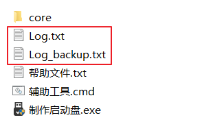
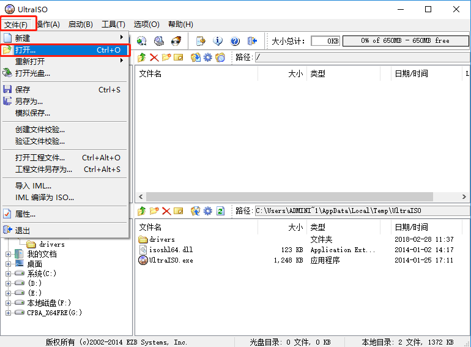
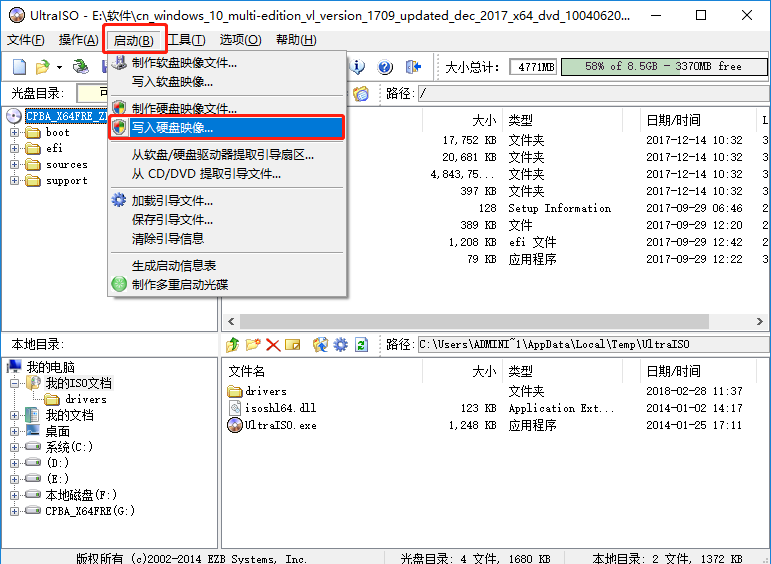
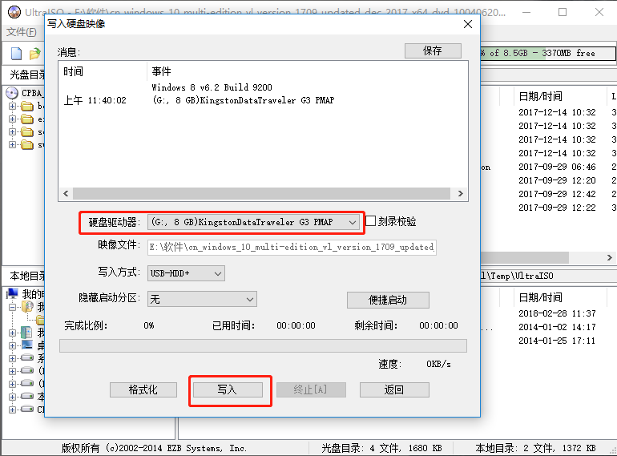

## 症状分析与解决方法
1. **（多发）制作工具所在路径过长导致路径传参失败**——请将其移动至桌面上或某分区根目录中运行
1. 您的系统编码出现了异常，批处理文件解释失败（通常为非正版系统）导致制作工具闪退
2. Edgeless服务器出现故障——使用离线模式制作启动盘，详情参考“帮助文件.txt”
3. 下载引擎出现故障导致闪退——运行`辅助工具.cmd`对下载引擎进行设置然后重启`制作启动盘.exe`
3. 其他问题，请[加入内测群](https://home.edgeless.top/jump/qqg.html)并提交`Log.txt`进行反馈（如果您进行了重试，请一并提交`Log_backup.txt`）

**如果上面的方法没有效果，请看下方的万能方案：**

1. 请**保持“制作启动盘.exe”处于运行状态**，然后手动运行core\UltraISO文件夹内的UltraISO.exe（下方图片来自[ywd1992的CSDN博客](https://blog.csdn.net/ywd1992/article/details/79399465)）

2. 打开Edgeless的ISO镜像（参考：[如何获取ISO镜像文件](如何获取ISO镜像文件.md)）

