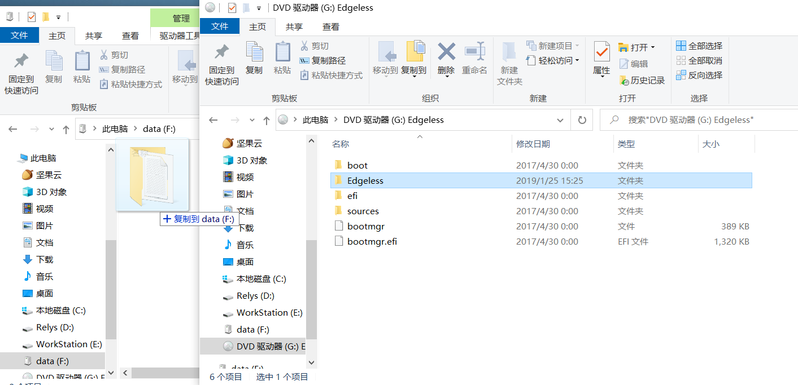
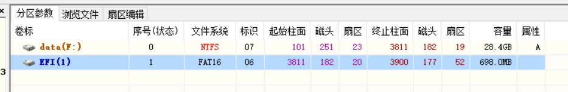
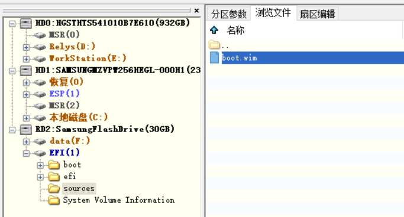

> 此方法适合已经制作了启动盘的用户免格式化使用Edgeless，并且获得宿主PE优秀的兼容能力
1. 打开ISO，将Edgeless文件夹复制到U盘的文件目录内

2. 使用DiskGenius等可以管理U盘隐藏分区的软件替换EFI分区的.wim文件，这里以UD方案制作的启动盘为例
2. 选择EFI分区并点击浏览文件

4. 查找.wim文件并进行替换

>注：
>1. 如果宿主PE制作时划分的分区太小导致Edgeless的wim文件无法复制进分区，则需要清空U盘重新制作
>2. 一些PE（如微PE）为了增强兼容性，可能会向U盘写入两份.wim文件放在不同的分区内，这种情况下两份文件都需要替换